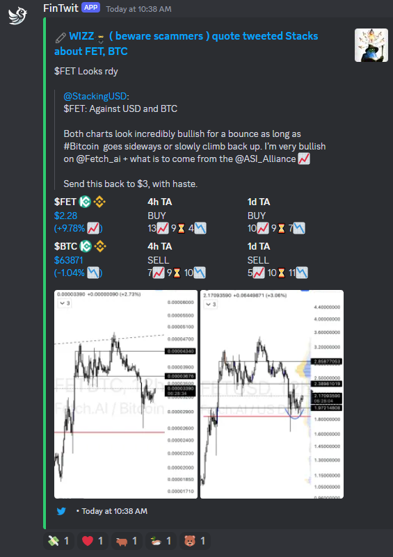

# FinTwit-Bot: Comprehensive Financial Markets Overview via Discord


---

<p align="center">
  
  
  <a href="https://github.com/psf/black"></a>
</p>

This is a Discord bot written in Python, this bot aims to provide an overview of the financial markets discussed on X / Twitter.
Not only data from Twitter is gathered, but other sources are used too, such as Reddit, Binance, Yahoo-Finance, TradingView, and many other related websites.
This bot was written with flexibility in mind, meaning that you can toggle on and off certain features without issues by using the `config.yaml` file.

## Key Features ⚙️

- **Automatic Sentiment Analysis**: Analyze the sentiment of tweets to gauge market mood.
- **Market Analytics**: Generate analytics for tickers mentioned in tweets and provide an overview of market trends.
- **Image Recognition**: Identify and analyze charts in tweets for visual insights.
- **Ticker Trends**: Track the most mentioned tickers to spot market interests.
- **Market Movers**: Get updates on trending topics, gainers, and losers in crypto and stocks.
- **TradingView Insights**: Display the top 10 TradingView ideas for various markets.
- **Market Events**: Monitor listings, delistings, and other significant events in the crypto world.
- **Stock Halts**: Keep track of the latest halted stocks on Nasdaq.
- **Portfolio Tracking**: Enable users to follow their crypto and stock investments.
- **Live Trading Updates**: View live trades from users who share their portfolios.
- **Hourly Market Updates**: Receive regular updates on indices across crypto, stocks, and forex.

For a detailed guide on all commands and functionalities, refer to the documentation included in the repo.

### Machine Learning Models 🤖

Currently, we use two machine learning models to help get better insights from the data collected by the bot. The following models are trained and developed by us with the purpose of being integrated with this Discord bot:

- [FinTwitBERT-sentiment](https://huggingface.co/StephanAkkerman/FinTwitBERT-sentiment): classify the sentiment of financial tweets
- [chart-recognizer](https://huggingface.co/StephanAkkerman/chart-recognizer): recognize if an image is a financial chart
  Both models are very lightweight and are automatically downloaded and setup if you run `main.py`.

### Tweet Example



In the image above you can see what the bot does with the data it receives from Twitter.
The green color of the embed shows that the sentiment of this tweet is positive.
The tickers mentioned in the tweet and the quoted tweet are shown below, both with the exchanges they are available on and the 4-hour and 1-day technical analysis (TA) from TradingView.

## Installation 🛠

```bash
# Clone this repository
git clone https://github.com/StephanAkkerman/fintwit-bot
# Install required packages
pip install -r requirements.txt
```

### Twitter Credentials 🐦

To access data from Twitter you need to follow these steps:

- To be able to get data from Twitter you need to have an account first (and follow some other users with it).
- After signing in go to your [Twitter Home page](https://twitter.com/home), here you can select either **For You** or **Following**. I suggest selecting **Following** as it makes it easier to manage the Tweets the bot will pull.
- Open DevTools (F12) and go to the Network tab.
- Locate **HomeLatestTimeline**, right click on it and press **Copy as cURL (bash)**.
- Create a new file in the root folder of this project named `curl.txt` and paste the contents there.

### Setup .env 📝

If you open `example.env` you will find the lines that need to be filled in. Start by renaming `example.env` to `.env` so the bot will use this file for you credentials.

#### Creating a Discord bot

For the first part, you can watch this [video (watch until 2:20)](https://www.youtube.com/watch?v=Pbq7vPsHDtc).

Or follow these written instructions:

- Setup your own Discord bot, following this [written tutorial](https://realpython.com/how-to-make-a-discord-bot-python/) or this
- Give the bot admin rights and all permissions possible, since this is the easiest way to set it up.
- Invite the bot to your server.

At last fill in the lines in the `example.env` file:

- Write your bot token behind `DISCORD_TOKEN:` (line 2)
- Write your server name behind `DISCORD_GUILD:` (line 3)

##### Adding custom emojis (Optional)

The bot uses custom emojis to recognize on which cryptocurrency exchange things can be bought. If you wish to use it, follow these steps:

- Locate the custom emoji pictures [here](https://github.com/StephanAkkerman/fintwit-bot/tree/main/img/emojis).
- Add them to your server ([instructions](https://support.discord.com/hc/en-us/articles/360036479811-Custom-Emojis)).
- You can add any exchange emoji, for instance, FTX, as long as the image is supported by Discord and the name is the same as the exchange.

#### Reddit API Credentials (Optional) 👽

If you do not want to track data from Reddit, feel free to skip this step.
I suggest creating a new account for this too, if you feel uncomfortable leaving your username and password.

- Go to https://old.reddit.com/prefs/apps/ and select **script**.
- The name of the app is needed for `REDDIT_APP_NAME`, click on **make app**.
- This will give you the `REDDIT_PERSONAL_USE` and `REDDIT_SECRET` tokens.
- Finally, fill in your Reddit username and password for `REDDIT_USERNAME` and `REDDIT_PASSWORD`.

### Discord Category and Channel Creation

Since there are multiple channels that are about the same topic, we need to put them in different categories so the bot knows where to find this channel. The categories are specified in the config file, feel free to change the names. Below you can find an example showing how we set up our Discord channel.

#### Example of Discord Categories and Channels

<details closed>
<summary>━━ 🔑 Information ━━</summary>

This is an optional category, where the github channel tracks the commits of this repo using the [GitHub webhook for Discord](https://gist.github.com/jagrosh/5b1761213e33fc5b54ec7f6379034a22).

- 🌐┃general
- 💻┃github
- ⌨┃commands

</details>
<details closed>
<summary>━━━ 🐦Twitter ━━━</summary>

- 📰┃news
- 📷┃images
- ❓┃other
- 💸┃highlights

</details>
<details closed>
<summary>━━━ 🎰 Crypto ━━━</summary>

- 📈┃charts
- 💬┃text
- 📊┃index
- 💡┃ideas
- 🔥┃trending
- 🚀┃gainers
- 💩┃losers
- 🏦┃funding
- 🆕┃listings
- 📰┃news
- 💸┃liquidations
- 🏆┃overview

</details>
<details closed>
<summary>━━━ 🐒 NFTs ━━━</summary>

- 🏆┃top
- 🔥┃trending
- 🌠┃upcoming
- 🎮┃p2e

</details>
<details closed>
<summary>━━━ 💵 Stocks ━━━</summary>

- 📈┃charts
- 💬┃text
- 📊┃index
- 💡┃ideas
- 🔥┃trending
- 🚀┃gainers
- 💩┃losers
- 📅┃earnings
- 🎤┃stocktwits
- 🏆┃overview

</details>
<details closed>
<summary>━━━🎯 Options ━━━</summary>

- 🏆┃overview
- 💣┃volume
- 💰┃spacs
- 📉┃shorts

</details>
<details closed>
<summary>━━━ 💱 Forex ━━━</summary>

- 📈┃charts
- 💬┃text
- 📊┃index
- 📣┃events
- 🏢┃yield

</details>
<details closed>
<summary>━━━ 👨 Users ━━━</summary>

- 💲┃trades

</details>
<details closed>
<summary>━━━ 👽 Reddit ━━━</summary>

- 🤑┃wallstreetbets

</details>
<details closed>
<summary>━━ Selected Traders ━━</summary>

These channels are also optional, but these are some of my favorite traders on Twitter.

- 🐺┃hsakatrades
- 🦁┃anbessa100
- 🔫┃cryptobullet1

</details>

## Contributing

Contributions are welcome! If you have a feature request, bug report, or proposal for code refactoring, please feel free to open an issue on GitHub. We appreciate your help in improving this project.\


## License

This project is licensed under the MIT License. See the [LICENSE] file for details.
